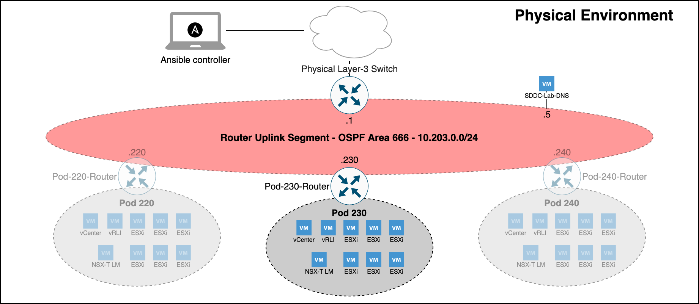

<style>
  red { color: red }
  green { color: green; font-weight: bold }
  yellow { color: yellow }
</style>

```
     _________________  _____       _           _             _____ 
    /  ___|  _  \  _  \/  __ \     | |         | |           |  ___|                 Developed By
    \ `--.| | | | | | || /  \/     | |     __ _| |__   __   _|___ \           --------------------------
     `--. \ | | | | | || |         | |    / _` | '_ \  \ \ / /   \ \          Rutger Blom  &  Luis Chanu
    /\__/ / |/ /| |/ / | \__/\  _  | |___| (_| | |_) |  \ V //\__/ /          NSX vExpert     VCDX #246
    \____/|___/ |___/   \____/ (_) \_____/\__,_|_.__/    \_/ \____/
```

## Table of Contents

* [Description](#description)
* [Requirements](#requirements)
  * [Recommendations](#recommendations)
* [Preparations](#preparations)
* [Upgrade Considerations](#upgrade-considerations)
* [Networking](#networking)
* [IP Address Assignments](#ip-address-assignments)
* [Usage](#usage)
* [Project Features](#project-features)
  * [NSX-T Federation](#nsx-t-federation)
  * [vSphere Content Libraries](#vsphere-content-libraries)
  * [Deploy Test Workloads](#deploy-test-workloads)
* [Known Items](#known-items)
* [Issues With Various Software Versions](#issues-with-various-software-versions)
* [More Information](#more-information)
* [Credits](#credits)


## Description

This repository contains Ansible scripts that perform fully automated deployments of complete nested VMware SDDC Pods. Each Pod contains:
* A [VyOS](https://www.vyos.io/) Router
* vCenter Server
* ESXi Hosts
* NSX-T Local Manager
* NSX-T Edge Nodes
* vRealize Log Insight
* A DNS/NTP Server (multi-Pod)



The primary use case is consistent and speedy provisioning of nested VMware SDDC lab environments.


## Requirements
The following are the requirements for successful Pod deployments:

* A physical ESXi host running version 6.7 or higher.
* A virtual machine with a modern version of Ubuntu (used as the Ansible controller)
* The default deployment settings require DNS name resolution. You can leverage an existing DNS server, but it must be configured with the required forward and reverse zones and support dynamic updates.
* Access to VMware product installation media.
* For deploying NSX-T you will need an NSX-T license (Check out [VMUG Advantage](https://www.vmug.com/membership/vmug-advantage-membership) or the [NSX-T Product Evaluation Center](https://my.vmware.com/web/vmware/evalcenter?p=nsx-t-eval)).
* If IPv6 deployment is enabled (Deploy.Setting.IPv6 = True):
  * Pod.BaseNetwork.IPv6 must be a fully expanded /56 IPv6 network prefix.  By default, [RFC4193](https://tools.ietf.org/html/rfc4193) ULA fd00::/56 prefix is used as a placeholder.
  * Router Version should be set to "Latest" (default)
  * It is recommended that the physical layer-3 switch be configured with OSPFv3 enabed on the Lab-Routers segment
  * The Ansible controller must be IPv6 enabled, and have IPv6 transit to the DNS server
  * DNS server must be IPv6 enabled
  * DNS server must have IPv6 forward and reverse zones
  * Within each Pod, only the following components are currently configured with IPv6:
    * Nested VyOS Router (All interfaces)
    * NSX-T Segments
    * NSX-T eBGP Peering with the Router

### Recommendations
The following are recommendations based on our experience with deploying Pods:

* Use a physical layer-3 switch with appropriate OSPF/BGP configuration matching the OSPF/BGP settings in your config.yml file. Dynamic routing between your Pods and your physical network will make for a better experience.
* Hardware configuration of the physical ESXi host(s):
  * 2 CPUs (10 cores per CPU)
  * 320 GB RAM
  * 1 TB storage capacity (preferably SSD). Either DAS or 10 Gbit NFS/iSCSI.  More space required if multiple labs are deployed.
* Virtual hardware configuration of the Ansible controller VM:
  * 1 vCPU (4 vCPUs recommended)
  * 8 GB RAM (16GB RAM recommended)
  * Hard disk
    * 64 GB for Linux boot disk
    * 300 GB for /Software repository (Recommend this be on it's own disk)
  * VMware Paravirtual SCSI controller
  * VMXNET3 network adapter
* Deploy the pre-configured DNS server for DNS name resolution within Pods instead of using your own.


## Preparations

* Configure your physical network:
  * Create an Lab-Routers VLAN used as transit segment between your layer-3 switch and the Pod [VyOS](https://www.vyos.io/) router.
  * Configure routing (OSPFv2/OSPFv3/BGP/static) on the Lab-Routers segment.
  * Add the Pod VLANs to your layer-3 switch in case you are deploying the Pod to a vSphere cluster. 

* Install the required software on your Ansible controller:
  * ```sudo apt install python3 python3-pip python-is-python3 xorriso git```
  * ```git clone https://github.com/rutgerblom/SDDC.Lab.git ~/git/SDDC.Lab```
  * ```pip3 install --upgrade -r ~/git/SDDC.Lab/pip3_requirements.txt```
  * ```ansible-galaxy collection install --upgrade -r ~/git/SDDC.Lab/requirements.yml```

The remaining commands in this section are performed from with the SDDC.Lab parent directory.

* Copy/rename the sample files:
  * ```cp ~/git/SDDC.Lab/config_sample.yml ~/git/SDDC.Lab/config.yml```
  * ```cp ~/git/SDDC.Lab/licenses_sample.yml ~/git/SDDC.Lab/licenses.yml```
  * ```cp ~/git/SDDC.Lab/software_sample.yml ~/git/SDDC.Lab/software.yml```
  * ```cp ~/git/SDDC.Lab/templates_sample.yml ~/git/SDDC.Lab/templates.yml```

* Modify ```config.yml``` and ```licenses.yml``` files according to your needs and your environment

* Create the Software Library directory structure and set folder permissions using:
  * ```ansible-playbook --ask-become-pass ~/git/SDDC.Lab/utils/util_CreateSoftwareDir.yml```

    NOTE: The above command will prompt you for the 'root' password.  This is needed as the playbook needs to obtain elevated permissions to create the directory tree and change file system permissions within the Software directory.

* Add installation media to the corresponding directories in the Software Library (/Software)


## Upgrade Considerations
Consider the following when upgrading SDDC.Lab to a newer version.

* v2 to v3
  * Clone the v3 branch to its own directory. For example: ```git clone https://github.com/rutgerblom/SDDC.Lab.git ~/git/SDDC.Lab_v3```
  * As additional PIP and Ansible modules are required by v3, please follow the instructions in the "Preparations" section to ensure all of the required software is installed on the Ansible controller.
  * Use copies of the v3 sample files and update these with your settings. Don't copy any v2 files into the v3 directory.
  * Remove the VyOS ISO file from your software library and let the router deployment script download the latest version of the rolling release.

* v3 to v4
  * The "SDDC Labs" folder has been renamed to "SDDC Pods" within the ```config_sample.yml``` configuration file.  It's suggestd that you renamed your folder and update this as part of updating your configuration files for v4.
  * TBD - More to come...


## Networking
The network configuration is where many users experience issues with the setup of the SDDC.Lab solution.  For that reason, the focus of this section is to give a deep dive into how the SDDC.Lab solution "connects" to the physical network, and what networking components it requires.  We will also give overviews of how the network connectivity is different if you're running:
* 1 Physical Server
* 2 Physical Servers
* 3 (or more) Physical Servers

### Logical Networking Overview
Before we dive into the physical network environment, it's important to understand logically how everything is configured and connected.  This is the **KEY** to understanding how SDDC.Lab works from a networking perspective.

Each SDDC.Lab that is deployed is referred to as a Pod.  Every Pod is assigned a number between 10-240 which is evenly divisble by 10.  So, valid Pod numbers include 10, 20, 30, ..., 220, 230, and 240.  The Pod number drives **ALL** networking elements used by that lab, includng, VLAN IDs, IP networks (IPv4 and IPv6), and Autonomous System Numbers (ASNx).  This ensures that no duplicate networking components exist between any of the Pods.

At the heart of each Pod is a software-based [VyOS](https://vyos.io/) router, which we call the Pod-Router.  The Pod-Router provides these main functions:
1. Connectivity to the physical environment
2. The gateway interfaces for the various SDDC.Lab networks

Connectivity to the physical environment is achieved via the Pod-Router's eth0 interface.  This interface is a an untagged interface, and is connected to the "Lab-Routers" portgroup (discussed later).  It's over this interface that the Pod-Router peers with other deployed Pods and the physical environment.

The Pod-Router provides gateways services for all of the SDDC.Lab's networks via it's eth1 interface.  Eth1 is configured as a tagged interface, and a unique layer-3 sub-interface (VyOS calls them vif's) is created for each of the SDDC.Lab networks.  These sub-interfaces act as the IPv4/IPv6 gateway for its respective SDDC.Lab network.

Each Pod is comprised of ten (10) SDDC.Lab networks, numbered 0 through 9.  These SDDC.Lab network numbers are added to the Pod number to create unique VLAN IDs for each Pod.  This explains why the Pod Numbers are divisible by 10.  Below are the SDDC.Lab networks that are deployed within each Pod (Pod Number 100 shown):

| Pod.Number | Network Number | MTU  | VLAN ID |    Description    |
|------------|----------------|------|------|-------------------|
|    100     |       0        | 1500 | 100   | Management (ESXi, NSX-T Edges, etc.) |
|    100     |       1        | 9000 | 101   | vMotion |
|    100     |       2        | 9000 | 102   | vSAN |
|    100     |       3        | 9000 | 103   | IPStorage |
|    100     |       4        | 9000 | 104   | Overlay Transport (i.e. GENEVE Traffic) |
|    100     |       5        | 1500 | 105   | Service VM Management Interfaces |
|    100     |       6        | 1500 | 106   | NSX-T Edge Uplink #1 |
|    100     |       7        | 1500 | 107   | NSX-T Edge Uplink #2 |
|    100     |       8        | 1500 | 108   | Remote Tunnel Endpoint (RTEP) |
|    100     |       9        | 1500 | 109   | VM Network |

In order to be able to deploy multiple Pods, VLAN ID's 10-249 should be reserved for SDDC.Lab use.

Here is a network diagram showing the Pod Logical Networking described above:


### Physical Networking Overview
When we refer to physical networking, we are referring to the "NetLab-L3-Switch" in the network diagram shown above, along with the "Lab-Routers" portgroup to which it connects.  The "Lab-Routers" portgroup is the central "meet-me" network segment which all Pods connect to.  It's here where the various Pods establish OSPFv2, OSPFv3, and BGP neighbor peerings and share routes.  Because OSPF uses multicast to discovery neighbors, there is no additional configuration required for it.  BGP on the other hand, by default, is only configured to peer with the "NetLab-L3-Switch".  This behavior can be changed by adding additional neighbors to the Pod Configuration file, but that is left up to the user to setup.  The routing protocols configured on the "NetLab-L3-Switch" should be configured to originate and advertise the default route to the [VyOS](https://vyos.io/) routers on the "Lab-Routers" segment.

To ensure VLAN IDs created on the "NetLab-L3-Switch" do not pollute other networking environments, and to protect the production network from the SDDC.Lab environment, it's **HIGHLY** recommended that the following guidelines are followed:
1. The VLAN IDs used by the SDDC.Lab environment (i.e. VLANs 10-249) should not be stretched to other switches outside of the SDDC.Lab environment.  Those VLANs should be local to the SDDC.Lab.
2. The uplink from the "NetLab-L3-Switch" to the core network should be a **ROUTED** connection.
3. Reachability between the SDDC.Lab environment and the Core Network should be via static routes, and **NOT** use any dynamic routing protocol.  This will ensure that SDDC.Lab routes don't accidentally "leak" into the production network.

All interfaces, both virtual and physical, that are connected to the "Lab-Routers" segment should be configured with a 1500 byte MTU.  This ensures that OSPF neighbors can properly establish peering relationships.  That said, the "NetLab-L3-Switch" must be configured to support jumbo mtu frames, as multiple SDDC.Lab segments require jumbo frame support.  Jumbo frame size of 9000 (or higher) is suggested.

### Physical Network Considerations - One ESXi Server
When only one physical ESXi server is being used to run Pod workloads, as all workloads will be running on the same vSwitch on that host, there is no requirement to configure an Uplink on the SDDCLab_vDS switch to the physical environment.

### Physical Network Considerations - Two ESXi Servers
When exactly two physical ESXi servers are being used to run Pod workloads, you can use a cross-over cable to connect the SDDCLab_vDS vswitches together via their Uplinks.  This cable between the two servers to connect the SDDCLab_vDS Uplink interface from each server.

### Physical Network Considerations - Three or more ESXi Servers
When three or more physical ESXi servers are being used to run Pod workloads, you have two options:
1. Use a single "NetLab-L3-Switch" and connect all servers to it (Suggested)
2. If the number of available ports on the "NetLab-L3-Switch" is limited, you can use two switches as is shown in the Pod Logical Networking Overview above.  In this configuration, a layer-2 only switch is used for the SDDCLab_vDS vswitch, and a layer-3 switch is used to connect to the "Lab-Routers" segment.


## IP Address Assignments
When a Pod is deployed, various components are deployed as part of that Pod.  Each of those components are connected to the Pod's Management subnet.  Here is a listing of those components along with their respective host IP address:

| IPv4 Address | Component | Description | DNS Name | Part of Default Deployment |
|-------------------|-----------|-------------|---|-------------------------|
| 1 | Gateway | VyOS Router | Pod-240-Router | <green> Yes </green> |
| 2 | Reserved | Reserved for Future Use | | |
| 3 | Reserved | Reserved for Future Use | | |
| 4 | Reserved | Reserved for Future Use | | |
| 5 | vCenter Server | vCenter Server Appliance | Pod-240-vCenter | <green> Yes </green> |
| 6 | Reserved | Reserved for Future Use  | | |
| 7 | GM VIP | NSX-T Global Manager VIP | Pod-240-NSXT-GM | <yellow> Only if deploying NSX-T Federation <yellow> |
| 8 | GM-1 | NSX-T Global Manager Node 1 | Pod-240-NSXT-GM-1 | <yellow> Only if deploying NSX-T Federation <yellow> |
| 9 | GM-2 | NSX-T Global Manager Node 2 | Pod-240-NSXT-GM-2 | <red> No </red> |
| 10 | GM-3 | NSX-T Global Manager Node 3 | Pod-240-NSXT-GM-3 | <red> No </red> |
| 11 | LM VIP | NSX-T Local Manager VIP | Pod-240-NSXT-LM | <green> Yes </green> |
| 12 | LM-1 | NSX-T Local Manager Node 1 | Pod-240-NSXT-LM-1 | <green> Yes </green> |
| 13 | LM-2 | NSX-T Local Manager Node 2 | Pod-240-NSXT-LM-2 | <red> No </red> |
| 14 | LM-3 | NSX-T Local Manager Node 3 | Pod-240-NSXT-LM-3 | <red> No </red> |
| 15 | AVI VIP | NSX-T Advanced Load Balancer (AVI) Controller VIP | Pod-240-AVI-Controller-VIP | <red> No </red> |
| 16 | AVI Controller-1 | NSX-T Advanced Load Balancer (AVI) Controller 1 | Pod-240-AVI-Controller-1 | <red> No </red> |
| 17 | AVI Controller-2 | NSX-T Advanced Load Balancer (AVI) Controller 2 | Pod-240-AVI-Controller-1 | <red> No </red> |
| 18 | AVI Controller-3 | NSX-T Advanced Load Balancer (AVI) Controller 3 | Pod-240-AVI-Controller-1 | <red> No </red> |
| 19 | vRLI VIP | vRealize Log Insight Cluster VIP | Pod-240-vRLI-VIP | <red> No </red> |
| 20 | vRLI-1 | vRealize Log Insight Appliance Node 1 | Pod-240-vRLI-1 | <green> Yes </green> |
| 21 | vRLI-2 | vRealize Log Insight Appliance Node 2 | Pod-240-vRLI-2 | <red> No </red> |
| 22 | vRLI-3 | vRealize Log Insight Appliance Node 3 | Pod-240-vRLI-3 | <red> No </red> |
| 23 | vRNI Platform | vRealize Network Insight Platform Appliance | Pod-240-vRNI | <red> No </red> |
| 24 | vRNI Collector | vRealize Network Insight Collector Node | Pod-240-vRNI-Collector | <red> No </red> |
| Thru 100 | Reserved | Reserved for Future Management VMs/Services | | |
| 101 | Mgmt-1 | Nested ESXi Host in vSphere Management Cluster | Pod-240-Mgmt-1 | <red> No </red> |
| 102 | Mgmt-2 | Nested ESXi Host in vSphere Management Cluster | Pod-240-Mgmt-2 | <red> No </red> |
| 103 | Mgmt-3 | Nested ESXi Host in vSphere Management Cluster | Pod-240-Mgmt-3 | <red> No </red> |
| 104-109 | Mgmt-*X* | Nested ESXi Host in vSphere Management Cluster | Pod-240-Mgmt-*X* | <red> No </red> |
| 111 | ComputeA-1 | Nested ESXi Host in vSphere ComputeA Cluster | Pod-240-ComputeA-1 | <green> Yes </green> |
| 112 | ComputeA-2 | Nested ESXi Host in vSphere ComputeA Cluster | Pod-240-ComputeA-2 | <green> Yes </green> |
| 113 | ComputeA-3 | Nested ESXi Host in vSphere ComputeA Cluster | Pod-240-ComputeA-3 | <green> Yes </green> |
| 114-119 | ComputeA-*X* | Nested ESXi Host in vSphere ComputeA Cluster | Pod-240-ComputeA-*X* | <red> No </red> |
| 121 | ComputeB-1 | Nested ESXi Host in vSphere ComputeB Cluster | Pod-240-ComputeB-1 | <red> No </red> |
| 122 | ComputeB-2 | Nested ESXi Host in vSphere ComputeB Cluster | Pod-240-ComputeB-2 | <red> No </red> |
| 123 | ComputeB-3 | Nested ESXi Host in vSphere ComputeB Cluster | Pod-240-ComputeB-3 | <red> No </red> |
| 124-129 | ComputeB-*X* | Nested ESXi Host in vSphere ComputeB Cluster | Pod-240-ComputeB-*X* | <red> No </red> |
| 131-139 | Reserved  | Future vSphere Cluster | | |
| 141-149 | Reserved  | Future vSphere Cluster | | |
| 151-159 | Reserved  | Future vSphere Cluster | | |
| 161-169 | Reserved  | Future vSphere Cluster | | |
| 171-179 | Reserved  | Future vSphere Cluster | | |
| 181-189 | Reserved  | Future vSphere Cluster | | |
| 191 | Edge-1 | Nested ESXi Host in vSphere Edge Cluster | Pod-240-Edge-1 | <green> Yes </green> |
| 192 | Edge-2 | Nested ESXi Host in vSphere Edge Cluster | Pod-240-Edge-1 | <green> Yes </green> |
| 193 | Edge-3 | Nested ESXi Host in vSphere Edge Cluster | Pod-240-Edge-1 | <green> Yes </green> |
| 194-199 | Edge-*X* | Nested ESXi Host in vSphere Edge Cluster | Pod-240-Edge-*X* | <red> No </red> |
| 201-205 | Reserved | Tanzu Supervisor Cluster Control Plane (Management) | | <red> No </red> |
| 206-210 | Reserved | Tanzu Supervisor Cluster Control Plane (ComputeA) | | <red> No </red> |
| 211-215 | Reserved | Tanzu Supervisor Cluster Control Plane (ComputeB)|  | <red> No </red> |
| 216-220 | Reserved | Tanzu Supervisor Cluster Control Plane (Compute*W*) | | <red> No </red> |
| 221-225 | Reserved | Tanzu Supervisor Cluster Control Plane (Compute*X*) | | <red> No </red> |
| 226-230 | Reserved | Tanzu Supervisor Cluster Control Plane (Compute*Y*) | | <red> No </red> |
| 231-235 | Reserved | Tanzu Supervisor Cluster Control Plane (Compute*Z*) | | <red> No </red> |
| 236-240 | Reserved | Tanzu Supervisor Cluster Control Plane (Edge) | | <red> No </red> |
| 241 | Reserved  | NSX-T Edge Transport Node  | | <red> No </red> |
| 242 | Reserved  | NSX-T Edge Transport Node  | | <red> No </red> |
| 243 | Reserved  | NSX-T Edge Transport Node  | | <red> No </red> |
| 244 | Reserved  | NSX-T Edge Transport Node  | | <red> No </red> |
| 245 | Reserved  | NSX-T Edge Transport Node  | | <red> No </red> |
| 246 | Reserved  | NSX-T Edge Transport Node  | | <red> No </red> |
| 247 | Reserved  | NSX-T Edge Transport Node  | | <red> No </red> |
| 248 | Reserved  | NSX-T Edge Transport Node  | | <red> No </red> |
| 249 | Reserved  | NSX-T Edge Transport Node  | | <red> No </red> |
| 250 | Reserved  | NSX-T Edge Transport Node  | | <red> No </red> |
| 251 | Reserved  | NSX-T Edge Transport Node  | | <red> No </red> |
| 252 | Reserved  | NSX-T Edge Transport Node  | | <red> No </red> |
| 253 | EdgeVM-02 | NSX-T Tier-0 Edge Transport Node 2 | Pod-240-T0-EdgeVM-02 | <green> Yes </green> |
| 254 | EdgeVM-01 | NSX-T Tier-0 Edge Transport Node 1 | Pod-240-T0-EdgeVM-01 | <green> Yes </green> |


## IP Address Assignments (<yellow>SDDC.Lab v4</yellow>)
When a Pod is deployed, various components are deployed as part of that Pod.  Each of those components are connected to the Pod's Management subnet.  Here is a listing of those components along with their respective host IP address:

| IPv4 Address | Component | Description | Part of Default Deployment |
|-------------------|-----------|-------------|----------------------------|
| 1 | Gateway | VyOS Router | Yes |
| 2 | Reserved | Reserved for Future Use | |
| 3 | Reserved | Reserved for Future Use | |
| 4 | Reserved | Reserved for Future Use | |
| 5 | vCenter | vCenter Appliance | Yes |
| 6 | vRLI | vRealize Log Insight Appliance | Yes |
| 7 | GM VIP | NSX-T Global Manager VIP | Only if deploying NSX-T Federation |
| 8 | GM1 | NSX-T Global Manager Node 1 | Only if deploying NSX-T Federation |
| 9 | GM2 | NSX-T Global Manager Node 2 | No |
| 10 | GM3 | NSX-T Global Manager Node 3 | No |
| 11 | LM VIP | NSX-T Local Manager VIP | Yes |
| 12 | LM1 | NSX-T Local Manager Node 1 | Yes |
| 13 | LM2 | NSX-T Local Manager Node 2 | No |
| 14 | LM3 | NSX-T Local Manager Node 3 | No |
| 15 | CSM | NSX-T Cloud Services Manager (Future) | No |
| 16 | vRNI Platform | vRealize Network Insight Platform Appliance | No |
| 17 | vRNI Collector | vRealize Network Insight Collector Node | No |
| 18 | Reserved | Reserved for Future Use | |
| 19 | Reserved | Reserved for Future Use | |
| 20 | Reserved | Reserved for Future Use | |
| 21 | Mgmt-1 | Nested ESXi Host in Management Cluster | No |
| 22 | Mgmt-2 | Nested ESXi Host in Management Cluster | No |
| 23 | Mgmt-3 | Nested ESXi Host in Management Cluster | No |
| 31 | ComputeA-1 | Nested ESXi Host in ComputeA Cluster | Yes |
| 32 | ComputeA-2 | Nested ESXi Host in ComputeA Cluster | Yes |
| 33 | ComputeA-3 | Nested ESXi Host in ComputeA Cluster | Yes |
| 41 | ComputeB-1 | Nested ESXi Host in ComputeB Cluster | No |
| 42 | ComputeB-2 | Nested ESXi Host in ComputeB Cluster | No |
| 43 | ComputeB-3 | Nested ESXi Host in ComputeB Cluster | No |
| 91 | Edge-1 | Nested ESXi Host in Edge Cluster | Yes |
| 92 | Edge-2 | Nested ESXi Host in Edge Cluster | Yes |
| 93 | Edge-3 | Nested ESXi Host in Edge Cluster | Yes |
| 101 | Reserved | Tanzu Supervisor Cluster Control Plane (Management) | No |
| 102 | Reserved | Tanzu Supervisor Cluster Control Plane (Management) | No |
| 103 | Reserved | Tanzu Supervisor Cluster Control Plane (Management) | No |
| 104 | Reserved | Tanzu Supervisor Cluster Control Plane (Management) | No |
| 105 | Reserved | Tanzu Supervisor Cluster Control Plane (Management) | No |
| 106 | Reserved | Tanzu Supervisor Cluster Control Plane (ComputeA) | No |
| 107 | Reserved | Tanzu Supervisor Cluster Control Plane (ComputeA) | No |
| 108 | Reserved | Tanzu Supervisor Cluster Control Plane (ComputeA) | No |
| 109 | Reserved | Tanzu Supervisor Cluster Control Plane (ComputeA) | No |
| 110 | Reserved | Tanzu Supervisor Cluster Control Plane (ComputeA) | No |
| 111 | Reserved | Tanzu Supervisor Cluster Control Plane (ComputeB) | No |
| 112 | Reserved | Tanzu Supervisor Cluster Control Plane (ComputeB) | No |
| 113 | Reserved | Tanzu Supervisor Cluster Control Plane (ComputeB) | No |
| 114 | Reserved | Tanzu Supervisor Cluster Control Plane (ComputeB) | No |
| 115 | Reserved | Tanzu Supervisor Cluster Control Plane (ComputeB) | No |
| 116 | Reserved | Tanzu Supervisor Cluster Control Plane (Edge) | No |
| 117 | Reserved | Tanzu Supervisor Cluster Control Plane (Edge) | No |
| 118 | Reserved | Tanzu Supervisor Cluster Control Plane (Edge) | No |
| 119 | Reserved | Tanzu Supervisor Cluster Control Plane (Edge) | No |
| 120 | Reserved | Tanzu Supervisor Cluster Control Plane (Edge) | No |
| 253 | EdgeVM-02 | NSX-T Edge Transport Node 2 | Yes |
| 254 | EdgeVM-01 | NSX-T Edge Transport Node 1 | Yes |


## Usage

To deploy a Pod:
1. Generate a Pod configuration with:  
```ansible-playbook ~/git/SDDC.Lab/playbooks/createPodConfig.yml```

2. Start a Pod deployment per the instructions. For example:  
```ansible-playbook -e "@/home/ubuntu/Pod-230-Config.yml" ~/git/SDDC.Lab/deploy.yml```

Deploying an SDDC Pod will take somewhere between 1 and 1.5 hours depending on your environment and Pod configuration.

Similary you remove a Pod with:  
```ansible-playbook -e "@/home/ubuntu/Pod-230-Config.yml" ~/git/SDDC.Lab/undeploy.yml```


## Project Features

### NSX-T Federation
When deploying NSX-T Federation, keep the following in mind:

1. Each NSX-T Location will be deployed from a separate SDDC.Lab Pod configuration file.

2. All of the Pods that are participating in the NSX-T Federation deployment (i.e. Which will become NSX-T Locations) need to have ```Deploy.Product.NSXT.Federation.Enable = true``` set in their configuration file.

3. The Global Manager Cluster (single VM) will be deployed by the Pod specified by ```Deploy.Product.NSXT.GlobalManager.SiteCode```.  As the value of this variable for each Pod defaults to their own ```SiteCode```, this value can be left at default for the Pod deploying the Global Manager.  All other Pods participating in NSX-T Federation need to update this value to the SiteCode of the Pod deploying the Global Manager.  For example, if the "Pod-100" is deploying the Global Manager, then the other Pods need to change this variable in their respective configurations to "Pod-100".

4. The Pod responsible for deploying the Global Manager Cluster is responsible for many aspects of the NSX-T Federation deployment.  Because of these extra steps, there may be instances when the other Pods are waiting for some component to come on-line.  This is normal and by design.

5. NSX-T Federation can only be deployed as part of a complete Pod deployment.  For that reason, the following Pod Configuration settings must all be enabled to deploy NSX-T Federation:\
  a) ```Deploy.Product.NSXT.Federation.Enable = true```\
  b) ```Deploy.Product.NSXT.LocalManager.Deploy = true```\
  c) ```Deploy.Product.NSXT.Edge.Deploy = true```

6. NSX-T Federation requires an NSX-T Enterprise Plus license, so be sure the proper license is included in your ```licenses.yml``` file.

7. SDDC.Lab only supports one (1) Tier-0 Gateway when NSX-T Federation is configured.  This Tier-0 Gateway will become the Stretched Tier-0 Gateway.

8. NSX-T Federation support is still being developed, so there might be some functional items missing as part of the automated deployment.

9. The ```config_sample.yml``` default configuration assumes the Lab-Routers transit segment, and thus communication between NSX-T Federation Locations, is configured with an MTU of 1500 bytes.  If your environment supports Jumbo Frames, you can obtain better performance by changing the MTU values in the Net section.  Keep in mind that the OSPF (by default) requires matching MTU sizes, so you may lose peering with your ToR router.  If you decide to change the MTU values, you need to take this all into account, and are on your own.  For a lab, the default 1500 byte MTU configurations should suffice.

10. SDDC.Lab does not support Federation with NSX-T v3.2.0.  If you want to deploy Federation in your lab, deploy Federation using NSX-T v3.1.3.7, then manually upgrade the Pods to NSX-T v3.2.0.

11. Automatic [Deployment of Test Workloads](#deploy-test-workloads) is not supported with Federation.

### vSphere Content Libraries
SDDC.Lab now supports both local and subscribed vSphere Content Libraries, which can be very helpful in a lab environment by centralizing workload ISOs and VMs (i.e. On the physical vCenter Server or a stand-alone Content Library target), then accessing them via the deployed Pods.  There are a few things to keep in mind with Content Libraries:

1. Make sure to provision sufficient Pod storage to store whatever content items are used.

2. If a specific datatstore is not specified in the config_sample.yml file (default), then the datastore used is dynamically selected from the available vSphere clusters.  If multiple vSphere clusters are deployed, the 'Edge' datastore is not used as it's assumed it's storage will be needed for NSX-T EdgeVMs.

3. By default, config_sample.yml assumes the published content library exists on the physical vCenter Server servicing the SDDC.Lab environment.  The default name of this content library is ```SDDC.Lab Content Library```.

4. Only one (1) Content Library can be automatically configured via SDDC.Lab.  If additional Content Libraries are required, those will need to be manually added after the Pod deployment has completed.

### Deploy Test Workloads
SDDC.Lab has a feature where it can automatically deploy test workload VMs from the Pod's content library at the end of the Pod deployment process.  The test workload VMs to deploy are defined in the ```WorkloadVMs``` section of the ```config_sample.yml``` file.  The default test workload VM included in ```config_sample.yml``` is called [TinyVM](https://github.com/luischanu/TinyVM), and it can be downloaded from the [TinyVM](https://github.com/luischanu/TinyVM) project site.  If you decide to leverage this feature, here are the items that need to be configured to enable the deployment of test workload VMs:

1. On your physical vCenter Server, create a content library called ```SDDC.Lab Content Library```, and enable the ```Enable publishing``` flag.

2. Add your test VM(s) to the ```SDDC.Lab Content Library``` on the physical vCenter Server.

3. Have your Pod's content library subscribe to the ```SDDC.Lab Content Library``` on the physical vCenter Server.  This is done by changing ```Nested_vCenter.ContentLibrary.Type``` to ```subscribed``` instead of ```local```.

4. Configure your test VM workloads in the ```WorkloadVMs``` section of ```config_sample.yml```.

5. Enable the WorkloadVMs functionality by setting ```Deploy.WorkloadVMs.Deploy``` to ```true``` in the ```config_sample.yml``` file.  By default, this setting is set to ```false```, thereby preventing the test workload VMs from being deployed.


## Known Items
Here are some known items to be aware of:
1. If you attempt to deploy a pod, and receive a message indicating "Error rmdir /tmp/Pod-###/iso: [Errno 39] Directory not empty: '/tmp/Pod-###/iso'", that's because a previous pod deployment failed (for whatever reason), and some files remained in the /tmp/Pod-### directory.  To resolve this issue, delete the entire /tmp/Pod-### directory, and then re-deploy the Pod.  If an ISO image is still mounted (which you can check by running 'mount'), then you will need to unmount the ISO image before you can delete the /tmp/Pod-### directory.  In all examples, the "###" of Pod-### is the 3-digit Pod Number.

2. The DNS IPv6 reverse zone used is determined by the network used for BaseNetwork.IPv6:\
   a) If it begins with "fd", then the zone used is ```d.f.ip6.arpa```\
   b) Otherwise, the zone used is a standard IPv6 reverse DNS zone for the configured /56 network

   This is important understand if you need to configure conditional forwarding to reach your SDDC.Lab environment.

3. SDDC.Lab v3 requires Ansible version 2.10.1 (or later).  Thus, if you are upgrading from SDDC.Lab v2, make 
   sure you upgrade your Ansible to the latest version.  To see your current Ansible version, run the following
   command: ```ansible --version```

4. If there is no local [VyOS](https://www.vyos.io/) ISO image in the software repository, SDDC.Lab will automatically download and use the latest nightly build of [VyOS](https://www.vyos.io/).  Keep in mind, however, that this nightly build is part of their development branch.  Because of this, they may make changes to their product or command syntax as part of their development, which might break the deployment of the Pod-Router.  For this reason, if/when you update your [VyOS](https://www.vyos.io/) software image within the software repository, we recommend that you do not delete the existing file, but rather, rename it, so that you can always fall-back to that file should there be changes in the newer version.  If after you download an updated [VyOS](https://www.vyos.io/) image you are unable to ping across the Pod-Router, or if you notice the Pod-Router is missing some configuration, this is probably the cause.  This is out of our control, and are very thankful to the [VyOS](https://www.vyos.io/) team for providing the nightly image build to the public for free.  That said, as we identify changes in the [VyOS](https://www.vyos.io/) command syntax, we will do our best to implement those changes in future releases.  As we make changes to this in our development branch, we'll do our best to also document them in the CHANGELOG.md file within our development branch.

5. When deploying a Federation configuration using NSX v4.0.0.1, the Workload VM Ansible playbook will fail when the playbook attempts to connect the VM's vNIC to the stretched NSX-T segment.


## Issues With Various Software Versions
As we use SDDC.Lab in our labs, every now-and-then we notice some issues/problems.  As we come across those, we'll try to very briefly document the versions and issue(s) below.  We do not test every software version combination, so by no means should this be taken as a comprehensive list of what works and what doesn't.  This is just a "best effort" from us, to you, in the hope that it saves you time and frustration.  Versions listed below match up with the software version used in config_sample.yml and the version "label" used in Software.yml.  Blank fields mean we believe they aren't relavent to the issue found, and thus, don't matter.

| Date | vCenter Server | ESXi    |  NSX-T  | Description Of Issue | Documented By |
|------|----------------|---------|---------|----------------------|---------------|
| 5-JAN-2022 | 7.0.0U3  | 7.00U2A |         | Migrating vDS Uplinks in createVds playbook fails.  Deployed fine in ESXi v7.00U3. | Luis Chanu |
| 5-JAN-2022 |          |         |  3.2.0  | NSX-T Federation deployment not supported. | Luis Chanu |
| 31-JAN-2022 |         |         |  3.2.0.1  | NSX-T Federation deployment not supported. | Luis Chanu |
| 20-FEB-2022 |         |         |  3.2.0.1  | NSX-T Global MTU Settings are not properly set. | Luis Chanu |
| 12-AUG-2022 |         |         |  4.0.0.1  | There is a bug with NSX Federation onboarding such that imported local objects are not properly migrated to global objects.  Because of this bug, you are unable to connect a VM's vNIC to imported stretched NSX Segments. | Luis Chanu |


## More Information
For detailed installation, preparation, and deployment steps, please see the "[Deploying your first SDDC.Lab Pod](FirstPod.md)" document.

We also suggest that you watch [our vBrownBag video](https://www.youtube.com/watch?v=caSkrOFs0qs) from VMworld 2021.  In that video, we provide an overview of the SDDC.Lab environment, and go over the various configuration files that need to be modified to deploy your first SDDC.Lab Pod.  We also explain the Pod configuration file, along with the reason why the ```createPodConfig.yml``` playbook needs to be run.  Keep in mind that this video is based on SDDC.Lab version 3.


## Credits
A big thank you to [Yasen Simeonov](https://www.linkedin.com/in/yasen/). His project at https://github.com/yasensim/vsphere-lab-deploy was the inspiration for this project. Another big thank you to my companion and lead developer [Luis Chanu](https://www.linkedin.com/in/luischanu/) (VCDX #246) for pushing this project forward all the time. Last but not least thank you vCommunity for trying this out and providing valuable feedback.