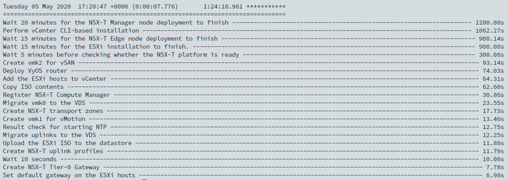
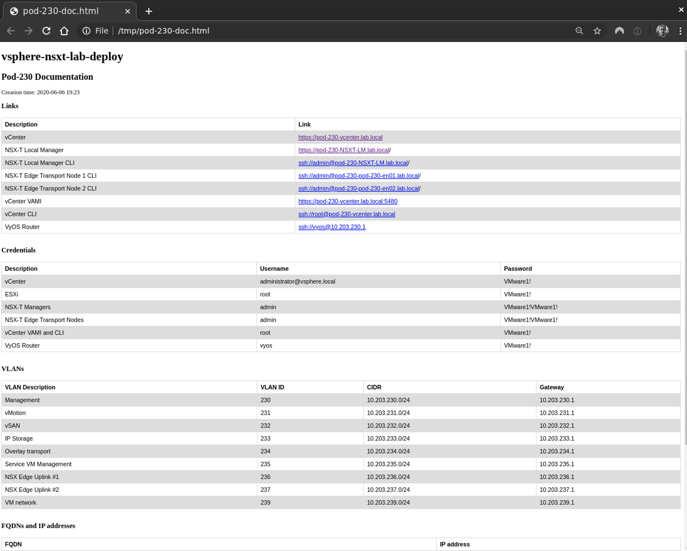
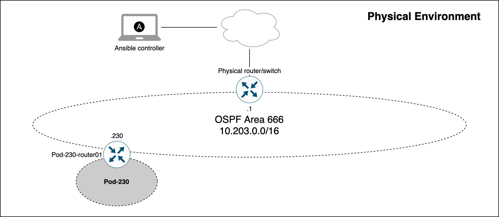
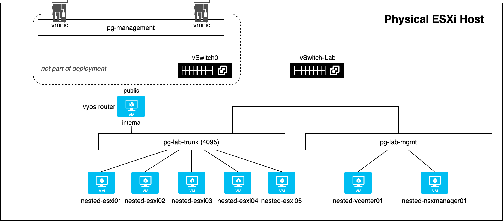
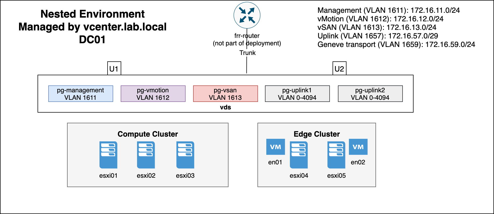

# SDDC.Lab

## Table of Contents

* [Description](#Description)
* [Changelog](#Changelog)
* [Requirements](#Requirements)
* [Usage](#Usage)
* [Compatibility](#Compatibility)
* [Pod deployment](#Pod-deployment)
  * [Footprint](#Footprint)
  * [Ansible play recap](#Ansible-play-recap)
  * [Pod documentation](#Pod-documentation)
  * [Diagrams](#Diagrams)
* [Development](#Development)
* [Credits](#Credits)

## Description

This repository contains Ansible Playbooks that perform automated deployments of complete vSphere-NSX-T pods. Each pod contains a router, vCenter, ESXi hosts, NSX-T Manager, and NSX-T Edge nodes. The primary use case is consistent provisioning of nested vSphere-NSX-T lab environments.

## Changelog

See [CHANGELOG.md](CHANGELOG.md)

## Requirements

* A physical standalone ESXi host running version 6.7
* The physical standalone ESXi host hostname must be resolvable by DNS.
* An Ubuntu 18.04/20.04 VM with the following software:
  * sudo apt install python3 python3-pip xorriso
  * pip3 install ansible pyvim pyvmomi netaddr
  * git clone https://github.com/rutgerblom/vsphere-nsxt-lab-deploy.git
  * ESXi and vCenter ISO files as well as the NSX-T Manager OVA file.
* For deploying NSX-T you need an NSX-T license (Check out [VMUG Advantage](https://www.vmug.com/membership/vmug-advantage-membership) or the [NSX-T Product Evaluation Center](https://my.vmware.com/web/vmware/evalcenter?p=nsx-t-eval)).
* A layer-3 switch with an appropriate OSPFv2 configuration matching the OSPFv2 settings in your answerfile. This is required when dynamic routing between the pod(s) and the physical network is enabled in your answerfile.
* The default settings in answerfile_sample.yml require a working DNS name resolution. Unless you configure your answerfile.yml to use IP addresses for vCenter and the ESXi hosts, the following DNS zones and records must be created on the DNS server:

  * lab.local (forward lookup zone)
  * 230.203.10.in-addr.arpa (reverse lookup zone)
  * pod-230-vcenter.lab.local - 10.203.230.5
  * pod-230-esxi-11.lab.local  - 10.203.230.11
  * pod-230-esxi-12.lab.local  - 10.203.230.12
  * pod-230-esxi-13.lab.local  - 10.203.230.13
  * pod-230-esxi-91.lab.local  - 10.203.230.91
  * pod-230-esxi-92.lab.local  - 10.203.230.92
  * pod-230-esxi-93.lab.local  - 10.203.230.93

## Usage

Copy **answerfile_sample.yml** to **answerfile.yml** and modify the settings according to your needs. 

Start a pod deployment with: **sudo ansible-playbook deploy.yml**

Remove a pod deployment with: **sudo ansible-playbook undeploy.yml**

## Compatibility

The following versions of vSphere and NSX-T can be deployed:
* ESXi version 6.7 and 7.0
* vCenter version 6.7 and 7.0
* NSX-T version 2.5 and 3.0

The following combinations can be deployed:
* NSX-T 2.5 on vSphere 6.7
* NSX-T 3.0 on vSphere 7.0

## Pod deployment

Using the default settings the following is deployed:
1. vSwitch and port groups on the physical ESXi host
1. VyOS router
1. vCenter Sever Appliance
1. 6 ESXi VMs
1. Configuration of the nested vSphere environment:
   * ESXi hosts
   * Distributed switch
   * vSphere clusters "Compute-A" and "Edge"
   * vSAN
1. NSX-T:
   * NSX Manager
   * vCenter Compute Manager (the deployed vCenter Server Appliance)
   * Transport Zones
   * IP pool for TEP
   * Uplink Profiles
   * Transport Node Profile
   * Two NSX-T Edge Transport Nodes
   * Edge Node Cluster
   * ESXi Transport Nodes
   * Tier-0 Gateway (NSX-T 3.0 only)
   * BGP peering with VyOS router (NSX-T 3.0 only)

### Footprint

Using the default settings the configured footprint for one pod is:
* 9 virtual machines
* 57 vCPU
* 420 GB vRAM
* 2076 GB storage (thin provisioned)
* 34 vNICS

### Ansible play recap

Ansible play recap from 9-JUNE-2020:

### Pod documentation

Pod documentation is generated as part of the deployment:

### Diagrams

The following diagrams help you understand the environment and components deployed with the default settings in the answerfile.

A diagram of the physical network.

A diagram of the physical ESXi host.

A diagram of the nested vSphere environment.

A diagram of the NSX-T logical network (provisioned with NSX-T 3.0 only).

## Development

* TODO: Add an option to deploy against vCenter
* TODO: Utilize data structures

## Credits

A big thank you to **Yasen Simeonov**. His project at https://github.com/yasensim/vsphere-lab-deploy was the inspiration for this project. Another big thank you to **Luis Chanu (VCDX #246)** for helping me push this project forward all the time. And thank you **vCommunity** for trying this out and providing valuable feedback.
